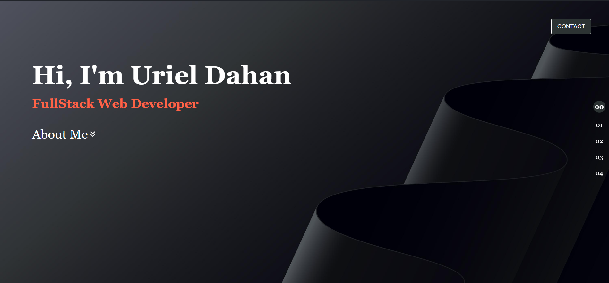
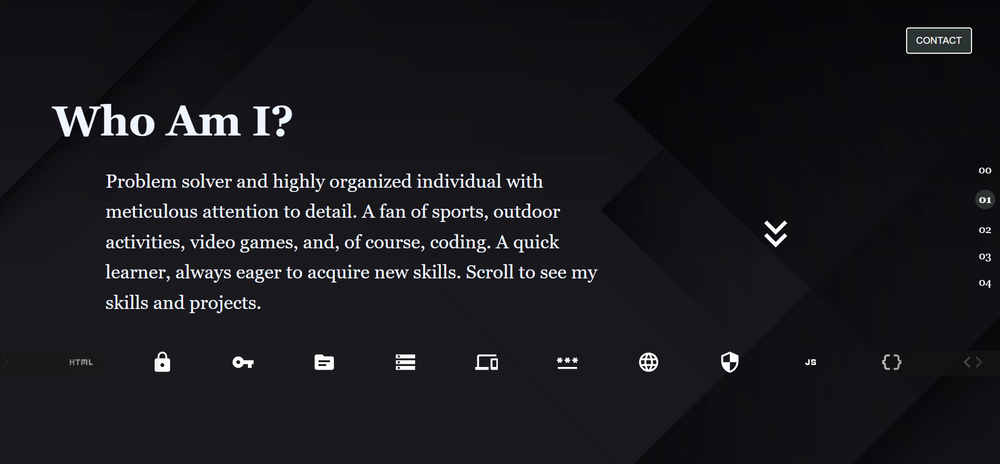
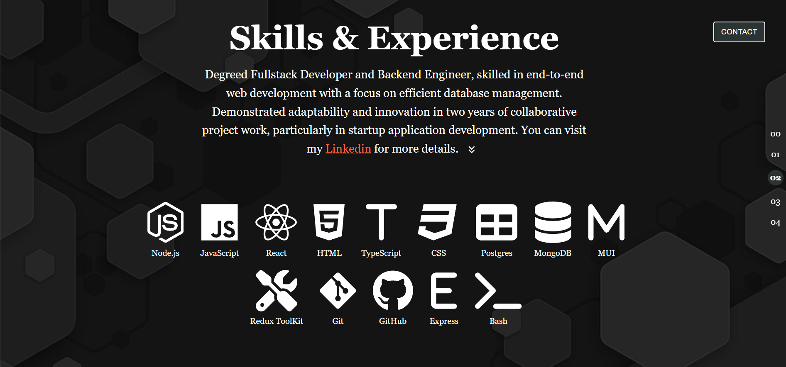
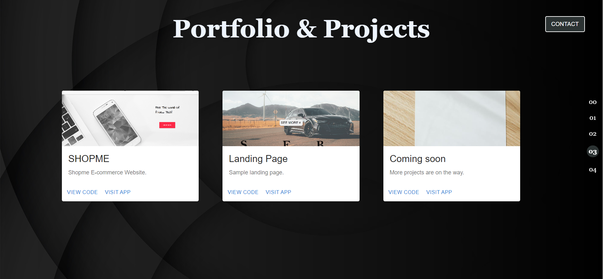
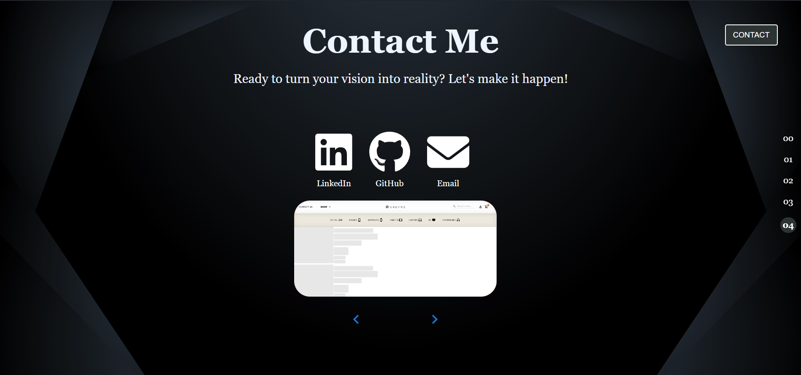

<h1 align="center"> 
  
     2024 Personal Portfolio Website
</h1>
<h6 align="center"> ©Uriel Dahan- 2024</h6>
<h4 align="center">
React.js, MUI, TypeScript 
</h4>

## Access to website

[SHOPME-site-link](https://shiny-scone-983945.netlify.app/)

# Sample photos:

   <h4>Home Page</h4>
      

   <h4>About Me Page</h4>
     

   <h4>Skills & Experience Page</h4>
     

   <h4>Projects page</h4>
     

  <h4>Contact Page</h4>
     
